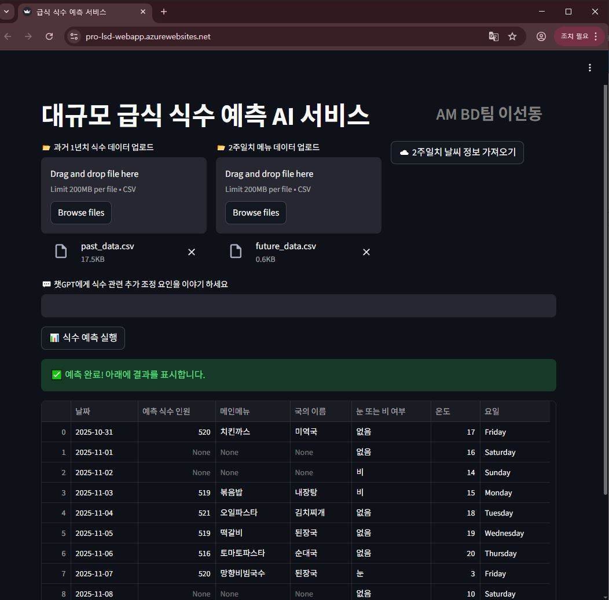
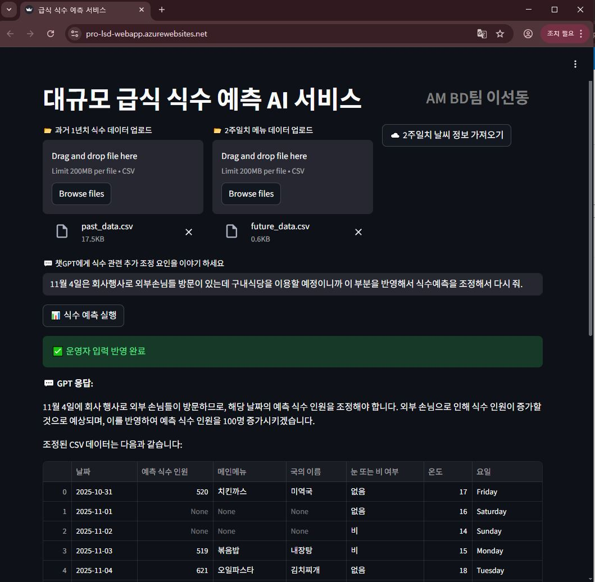

## MS_AI_Edu_Project                            AM BD팀 이선동 
### MVP제작
 1. 프로젝트명
    * 대규모 급식사이트의 식수 예측 AI서비스 (https://pro-lsd-webapp.azurewebsites.net/)

 2. 배경
    * 대규모 급식의 경우 여러 가지 원인으로 예측된 식수에 맞게 준비작업이 되지 않는 경우가 발생
    * 준비된 음식이 모자라는 경우 구내식당을 찾은 구성원들에게 신뢰도 하락으로 재방문이 줄어드는 악순환 유발
    * 준비된 음식이 남는 경우 대량 잔반에 대한 비용낭비로 이후 메뉴에서 기회비용 상실 및 환경오염 유발 

 4. 목적
    * 대규모 급식의 식수에 영향을 미치는 요인들을 분석하여 최대한 정확하게 식수를 예측해 냄으로써
     구성원들의 신뢰도 상승 및 잔반비용을 줄여 그 다음 메뉴의 단가를 높혀 급식의 질을 향상
    * KT그룹의 사이트별 급식사업을 진행하는 KT나눔재단을 대상으로 서비스 검증 후 대외 급식업체 대상 사업 진행  

 6. 구현상세 - Front
    * 급식사이트별 운영관리자(영양사)가 접속가능한  web구현(streamlit)
    * 하단부 식수관련 문의 및 데이터 조회/수정 진행을 위한 챗봇(RAG)
    * 과거 1년치의 날짜별 실제 식수 데이터 파일/미래 2주일치 메뉴 데이터 파일 Upload 기능 구현
    * 오늘 기준 이후 2주일치 예상 식수인원 데이터 조회 기능 구현     
    
 6. 구현상세 - Backend
    * 식수에 영향을 미치는 요인
       - 계절 및 당일의 날씨
         - 춥지도 덥지도 않은 쾌적한 온도에 눈/비 없는 경우 구내식당 이용율 저하 
       - 국경일, 공휴일, 정부지정 연휴의 시작일 및 종료일 등 사회적 요인
       - 휴가철 및 자녀들의 방학기간 등
       - 메뉴의 종류
    * 예측방법
       - 과거 1년동안의 날짜별 실제 식수 데이터를 기반으로 prophet모델 활용한 1달치 식수 예측데이터 1차 생산
       - 예측 작업 시작일 기준 2주일 날씨 및 온도 요소 반영하여 예측 데이터 수정 변경
       - 1차 데이터 기준 급식사이트 운영관리자의 그 날 그 날 추가 데이터를 반영하여 1차 예측데이터 수정 변경
    * 구현
       - Azure Blob, Azure OpenAI

7. UI 및 데이터파일 구성
   * 화면상단 왼쪽에 과거 1년치의 날짜별 실제 식사했던 식수인원과 그 날의 서울 서초구 방배동의 낮 12시 기준 날씨(눈 또는 비 여부/온도)정보, 실제 제공됬던 주요메뉴 2가지로 구성된 past_data.CSV파일 업로드 버튼
   * 화면상단 중앙에는 오늘부터 2주일간의 일별 주요메뉴 2가지로 구성된  future_data.CSV파일 업로드 버튼
   * 화면상단 오른쪽에는 오늘부터 2주일간의 서울시 서초구 방배동 위치에서 낮12시 기준의 날씨 정보 가져오기 버튼
   * 위 3개 버튼 아래에 GPT와 챗을 할 수 있는 입력창
   * 과거 1년치의 past_data.CSV파일의 컬럼은 날짜/요일/눈 또는 비여부/온도/메인메뉴/국의 이름/실제 식사했던 인원. 이렇게 6가지로 구성
   * 오늘부터 2주일간의 주요메뉴 데이타파일인 future_data.CSV는 날짜/요일/메인메뉴/국의 이름. 이렇게 4가지로 구성
   * 날씨정보는 날짜/요일/눈 또는 비 여부/온도. 이렇게 4가지 컬럼으로 구성된 future_wether.CSV파일로 저장 
   * 입력창 아래는 예측된 미래의 정보를 보여주는 위치로써 오늘부터 2주일간의 메뉴와 예측한 식수인원, 그 날의 날씨를 각 날짜별로(요일도 포함) 장표형태로 노출
   * 예측된 미래정보는 meal_cover.CSV 형태로 저장

8. 단계별 예측
   * 1단계 예측 : 해당 급식사이트의 지난 1년간 데이터(날짜별 실제 식수 / 요일 / 날짜별 메뉴 / 날짜별 눈,비 여부/ 날짜별 온도)파일을 propeht모델에게 학습시키고 미래 2주일치 미래 예측 데이터 생성
   * 2단계 예측 : 1단계 예측데이터에 미래 2주일치의 눈,비 여부 / 온도 / 요일 / 메뉴 데이터를 통해
   식수 영향 요소 가중치를 날짜별로 추가하여 미래 예측 데이터 생성
   * 3단계 예측 : 즉흥적 행사나 추가 휴일 정보 또는 갑작스런 날씨 변경 등의 요인들에 대해 급식 운영관리자가 gpt와 챗을 통해 재예측 요청을 하면 기존 2단계 예측 데이터 기준으로 gpt가 예측 식수인원데이터를 조정해서 재생성 
   (예시 : 11월 4일은 회사행사로 외부손님들 방문이 있는데 구내식당을 이용할 예정이니까 이 부분을 반영해서 식수예측을 조정해서 다시 줘. )

9. 사용자 시나리오 및 식수 영향 요인
   * 서초구 방배동의 KT구내식당 운영자는 오늘부터 2주일간의 매일 점심에 방문이 에상되는 식수 인원을 알고 싶다.
   * 구내식당을 이용 할 수 있는 총 구성원의 수는 1000명이다.
   * 구내식당 운영자는 과거의 1월1일부터 12월31일까지 휴일을 제외한 구내식당 운영시 각 날짜별 메인메뉴와 국의 이름, 그리고 식사했던 인원를 적어둔 데이타 파일(past_data.CSV)을 업로드한다,
   * 구내식당 운영자는 오늘부터 2주일간의 각 날짜별 점심식사의 메인메뉴와 국의 이름을 적어 둔 데이타 파일(future_data.CSV)을 업로드한다.
   * 본 서비스는 업로드된 데이타 파일을 연결되어 있는 Azure Blob Storage의 cafeteria 컨테이너에 저장한다. 
   * 본서비스는 Blob컨테이너에 future_data.CSV가 저장된 이벤트를 트리거로 오늘부터 2주간의 날짜별 예상 식수 인원 예측 작업을 시작한다.
   * 예측작업은 prophet모델을 이용한다.
   * 식수 예측 작업에 영향을 미치는 요소는 미래의 해당 날짜의 날씨와 제공될 예정인 메뉴(메인메뉴와 국)가 있다.
   * 기본적으로 비나 눈이 오는 경우 구내식당 이용율이 높아지나 날씨가 화창하고 춥지도 덥지도 않은 쾌적한 온도(섭씨 15도 ~ 섭씨 27도)인 경우 구내식당 이용율은 낮아진다.
   * 메인메뉴가 고기요리, 돈까스 등 튀김요리, 국수, 파스타 등 별미요리가 나오거나 국이 일반적인 채소국이 아닌 고깃국, 뼈해장국, 육개장 등 별미의 국요리가 나오는 경우 구내식당 이용율은 높아진다.
   * 주말 및 공휴일은 운영하지 않으며 금요일의 경우 구내식당 이용율이 낮아진다.
   * 본 서비스는 식수 예측작업시 과거 1년중 예측하려는 날짜의 실제 식사했던 식수인원을 기준으로 위에 이야기한 그 날의 날씨와 메뉴를 확인하여 각 가중치를 고려하여 예측하려는 미래 날짜의 날씨와 메뉴를 확인하여 가중치를 주어서 예측한다.
   * 본서비스는 예측작업이 완료되면의 예측된 내용을 meal_cover.CSV로 만들어 연결된  blob의 컨테이너에 저장하고 챗입력창 아래에 예측된 데이터들을 장표형태로 노출한다.
   * 본서비스는 예측작업이 진행된 이후라도 구내식당 운영자가 챗을 통해 예측식수에 변경될만한 내용을 입력하는 경우, 예를 들어 "다음 주 수요일은 회사행사로 평소보다 적은 인원이 식사할 것 같아" 이렇게 입력된 내용을 고려하여 다시 2주일치의 예측데이터를 만들고 저장하고 화면에 노출한다.
   * 본서비스는 meal_cover.CSV에 대해서는 새로 생성될 때마다 파일명 뒤에 24시간 단위의 생성된 시간데이터를 붙혀서 새로운 파일로 생성하고 기존 파일을 업데이트 하지 않는다.

10. 데이터 파일 구조
   * past_data.csv  날짜 / 요일 / 눈 또는 비 여부 / 온도 / 메인메뉴 / 국의 이름 / 실제 식사 인원
   * future_data.csv 날짜 / 요일 / 메인메뉴 / 국의 이름
   * future_weather.csv 날짜 / 요일 / 눈 또는 비 여부 / 온도
   * meal_cover_YYYYMMDDHH.csv 날짜 / 요일 / 날씨 / 온도 / 메뉴 / 예측 식수 인원

11. 예측에 필요한 가중치 요소
   * 날씨 - 눈/비가 오면 식당 이용율 증가 - 영향도+
   * 온도 - 15~27도 사이 쾌적하면 이용율 감소 - 영향도-
   * 메인메뉴 - 제육볶음, 간장불고기, 닭도리탕, 고추장불고기, 돈까스, 치킨까스, 떡갈비, 잔치국수, 망향비빔국수, 토마토파스타, 오일파스타, 봉골레, 햄버거, 등 별미 - 영향도+
   * 국 종류 - 육개장, 뼈해장국, 소고기무국, 한우국밥, 내장탕, 순대국 등 별미 - 영향도+
   * 요일 - 금요일은 이용율 감소 - 영향도-
   * 공휴일/주말 - 운영 안 함 -> 예측 제외 - 영향도 0

12. 동작화면
   
   
   
13. 향후 확장 아이디어
   * 농산물 가격 API 연동 → 메뉴 추천 최적화
   * 영양소 데이터베이스 연계 → 건강식단 자동 추천
   * SaaS 형태로 외부 기업 구내식당 서비스화
   * Power BI 연계 → 경영진 보고용 대시보드

 
 

[def]: predict1.jpg